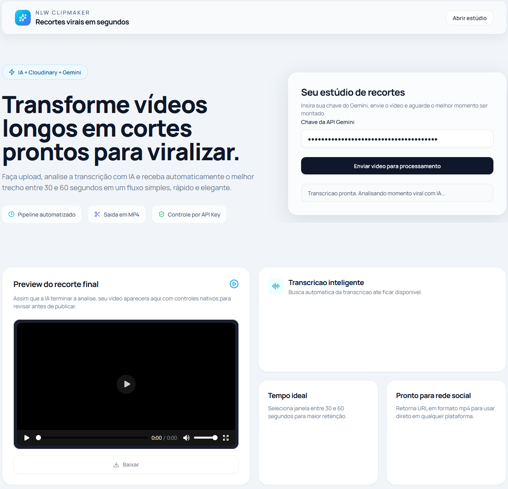
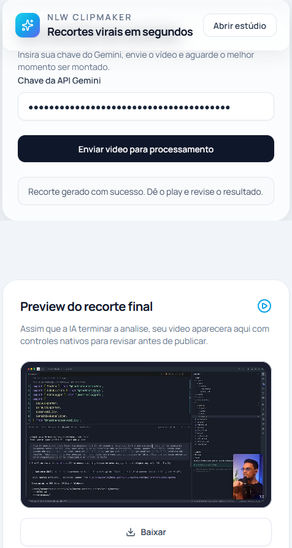

# NLW22 ClipMaker

Aplicação web desenvolvida duranto a NLW para transformar vídeos longos em cortes curtos com potencial viral, integrando upload de mídia, transcrição automática e análise por IA em uma experiência simples e visual.

O projeto foi pensado como peça de portfólio para demonstrar integração com IA e consumo de APIs externas, além da construção de uma interface moderna usando HTML, CSS e JavaScript puro.

**Felipe Mendes**  
Desenvolvedor Full Stack Júnior

## Contato

## Preview

 

## Sobre o projeto

O ClipMaker recebe um vídeo, aguarda a transcrição gerada pelo Cloudinary e utiliza o Gemini para identificar automaticamente o trecho mais promissor para retenção e viralização. Ao final, a própria URL do Cloudinary entrega o vídeo recortado em MP4, pronto para visualização e download.

Este fluxo foi desenhado para demonstrar:

- Integração com IA e consumo de APIs externas
- Experiência de upload e processamento orientada por feedback visual
- Construção de interface responsiva com foco em apresentação de produto
- Orquestração de etapas assíncronas no frontend

## Funcionalidades

- Upload de vídeo com Cloudinary Upload Widget
- Espera automática pela transcrição do arquivo enviado
- Análise da transcrição com Gemini para selecionar o melhor recorte
- Geração de trecho entre 30 e 60 segundos
- Reprodução do resultado diretamente na interface
- Download do vídeo final em MP4
- Mensagens de status durante todo o processamento

## Tecnologias utilizadas

- HTML5
- CSS3
- Tailwind CSS via CDN
- JavaScript Vanilla
- Lucide Icons
- GSAP
- Cloudinary Upload Widget
- Gemini API

## Fluxo da aplicação

1. O usuário informa uma chave válida da API do Gemini.
2. O vídeo é enviado pelo widget do Cloudinary.
3. A aplicação aguarda a geração da transcrição.
4. A transcrição é enviada ao Gemini com um prompt específico para retornar apenas o intervalo ideal do corte.
5. O Cloudinary monta a URL do vídeo já recortado com base no intervalo retornado.
6. O usuário visualiza e baixa o resultado final.

## Como executar

## Atenção

Este projeto foi construído com foco em estudo, demonstração técnica e portfólio.

Atualmente, a chave da API do Gemini é informada diretamente no frontend. Em ambiente de produção, o ideal é mover essa integração para um backend, protegendo credenciais e aplicando controles de segurança.

## Aprendizados do projeto

Este projeto consolida prática em:

- Integração com IA e consumo de APIs externas
- Manipulação de fluxos assíncronos no frontend
- Construção de interfaces com foco em clareza visual e experiência do usuário
- Integração entre serviços de mídia, transcrição e geração de conteúdo
